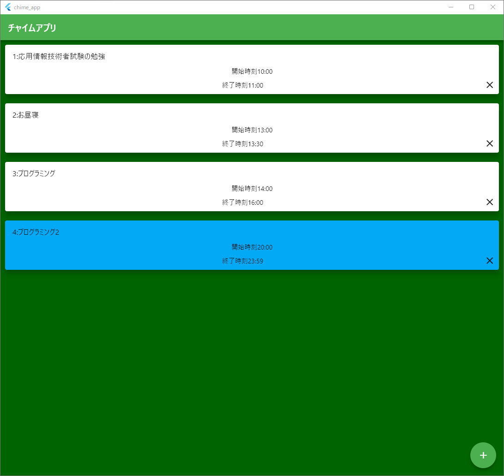
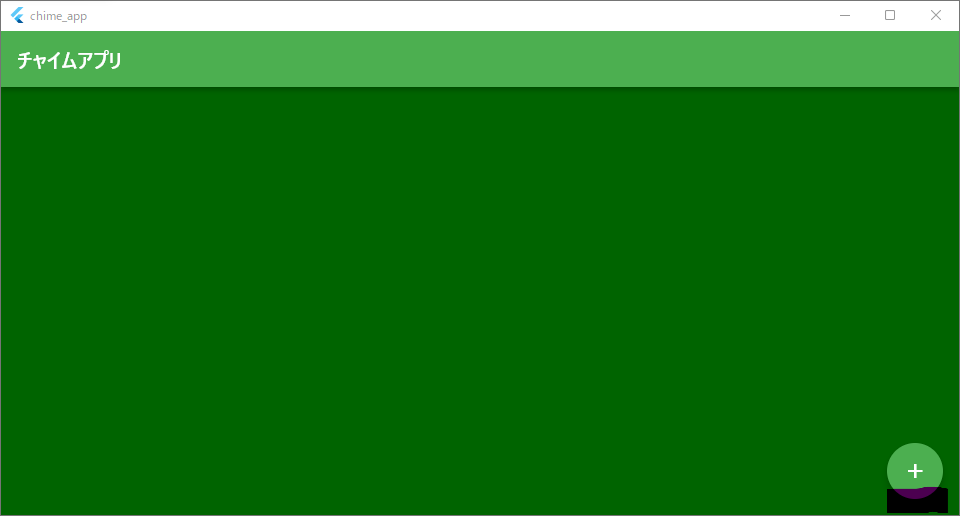
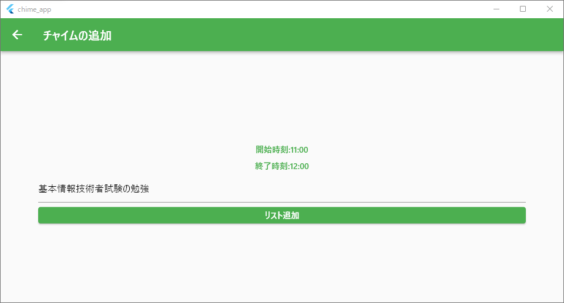
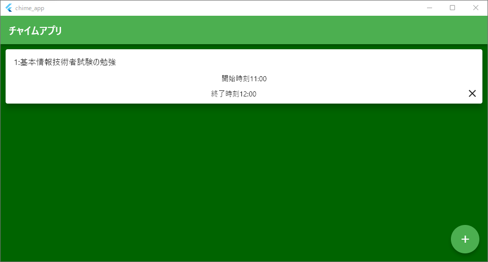

~~なんだこの時間割~~
# チャイムアプリ

これはオリジナルの時間割を作れて、時間になるとチャイムでお知らせしてくれるソフトです。   
時間が自由に使える時、メリハリがなくなり時間があるのに作業が全然進まないため、このツールを作りました。     
なので、ニート支援ソフトウェアです。

## Getting Started
1. 追加ボタンを押してください。

2. 時間割を入力します。始まりの時刻と終わりの時刻を入れて、授業名(やること)を入れてください。
3. 

3. 時間割の一覧に追加されます。授業が始まる時刻になるとチャイムがなるのでこの時間はその作業に集中しましょう。現在進行中の授業は青色に表示されます。

## TODO
* チャイムがモノラル再生になる問題
* 追加した時間割を編集できるようにする

## 使用した素材
チャイム効果音:[魔王魂様](https://maou.audio)
